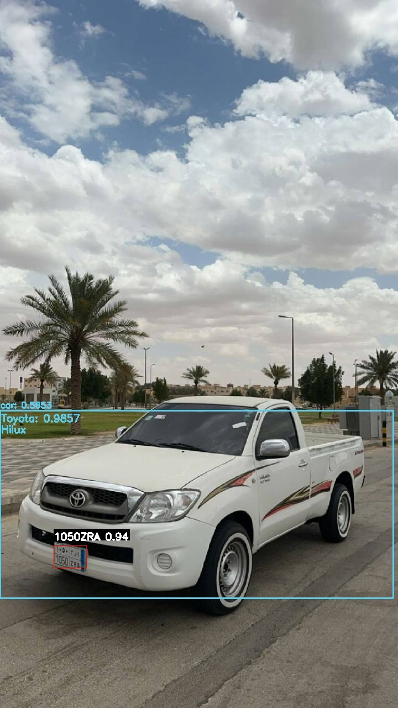

# AntiSpoofSys

AntiSpoofSys is an AI-powered vehicle gate access system designed to enhance security and efficiency. It leverages advanced machine learning and computer vision techniques to verify vehicles, license plates, and drivers in real-time, ensuring a seamless and secure access experience.

---

## Features

- **License Plate Recognition:**
  - Detects and authenticates license plates, including Saudi-specific formats.
 

- **Vehicle Classification:**
  - Identifies vehicle make and model (e.g., Toyota Camry, Honda Accord, Ford Crown Victoria).

- **Facial Recognition:**
  - Authenticates drivers using advanced facial recognition.


- **Real-Time Performance:**
  - Provides fast and reliable detection and authentication.

---

## Model Overview

### **Requirements:**
-  Python3.9
-  tensorflow==2.16.1
-  torch==2.3.0
-  onnx==1.16.0
-  onnxruntime==1.17.3
-  opencv-python==4.9.0.80
-  scikit-image==0.23.2
-  albumentations==1.4.6
-  numpy==1.26.4
-  scipy==1.13.0
-  psycopg2-binary==2.9.9
-  matplotlib==3.8.4
-  insightface==0.7.3
-  rich==13.7.1
-  tqdm==4.66.4

### **How It Works:**
1. Captures video input or live stream to detect vehicles, license plates, and faces.
2. Verifies the 3 features against a database.
3. Opens the gate for verified entries.

---

## Demo


---

## Installation

1. **Clone the Repository:**
   ```bash
   git clone https://github.com/yourusername/AntiSpoofSys.git
   ```

2. **Navigate to the Project Directory:**
   ```bash
   cd AntiSpoofSys
   ```

3. **Install Dependencies:**
   ```bash
   pip install -r requirements.txt
   ```


 ---
## Retrain License Plate Model
- **License Plate Detection:**
  - Gather your own dataset of images of cars that have license plates on them and put it into ^%$# folder
  - Label (rename) each image with the X and Y coordinates of the license plate, as shown in the image below.
  - 
  - run 'MTCNN/data_set/preprocess.py' to split training data and validation data and put in "ccpd_train" and "ccpd_val" folders respectively.
  - run 'MTCNN/data_preprocessing/assemble_Pnet_imglist.py'
  - run 'MTCNN/train/Train_Pnet.py'
    
  - collect Pnet weights and run 'MTCNN/data_preprocessing/gen_Onet_train_data.py'
  - run 'MTCNN/data_preprocessing/assemble_Onet_imglist.py'
  - run 'MTCNN/train/Train_Onet.py'
- **License Plate Recognition:**
  - Gather your own dataset of images of pure license plates and put them in folder !@#$%.
  - image size must be 94X24
  - rename each image to the license plate characters (e.g., ABC1234.jpg)
  - run 'LPRNet/data/preprocess.py' to prepare the dataset
  - run 'LPRNet/LPRNet_Train.py' for training

---

## Set Up the Database
   - Ensure PostgreSQL is installed and running.
   - Create a database using SQL (see database.sql file for reference)
   ```bash
     psql -U <username> -c "CREATE DATABASE <database_name>;"
   ```
   - Execute the provided SQL file to initialize the database:
    ```bash
    psql -U <username> -d <database_name> -f database.sql
    ```

    - `<username>`: Your PostgreSQL username.
    - `<database_name>`: Desired database name.
    
---


## Run the model
   ```bash
   python3 main.py
   ```


---

## Contribution

Contributions are welcome! Follow these steps:
1. Fork the repository.
2. Create a new branch for your feature or bug fix.
3. Submit a pull request with a detailed explanation.

---

## Contact

For questions or suggestions, feel free to reach out to the project team:
- **Thamer Alghonaim**: thamer.alghonaim@gmail.com
- **Muhannad Alsultan**: muhannad.a.alsultan@gmai.com
- **Faisal Alasakakir**: alsakakir.faisal@gmail.com
